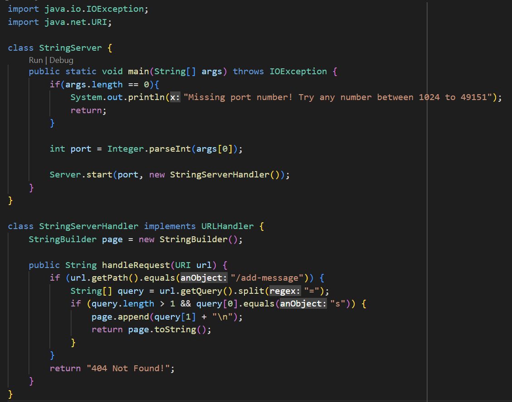
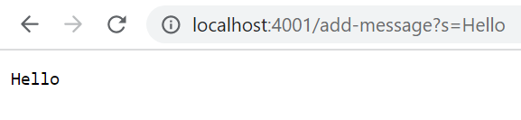
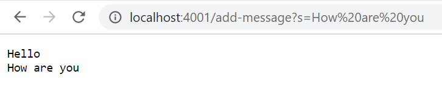
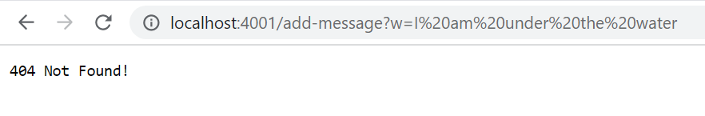
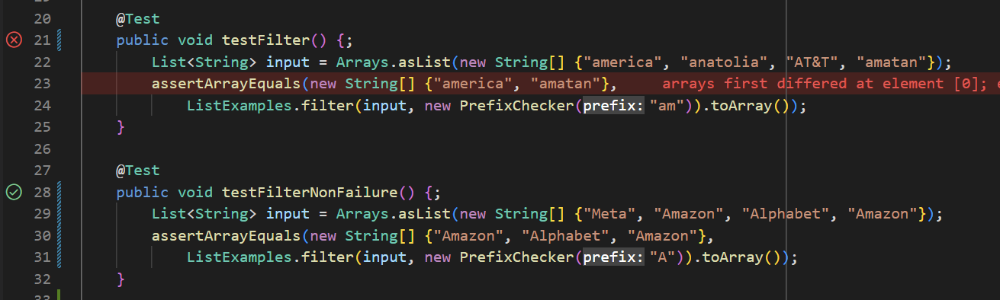

# Part 1
Here, we will create a web server called `StringServer`.

Here's the code for it!



And here's the result it produces.



With this query, the `URLHandler`'s `handleRequest` method gets called with the URI argument being the `localhost:4001/add-message?s=Hello`, which passes it onto the `StringServerHandler`.

We then call the url's `getPath()`, which returns `/add-message` in this case. Because of this, we `getQuery()` of the URI, which should return `s=Hello`. We then split the string by the `=`, resulting in an array `["s", "Hello"]`.

We check if the length of the array is at least 2 and then check if the first member, the parameter name, `equals()` "s". 

The `page.append()` then appends the query plus the newline character `\n` to the `StringBuilder`, called `page`, which has already been initialized. After this, we return the string representation of the page: `page.toString()` to get the page.

The `page` is the only value of the class that changes after the request. The other values within the method `handleRequest()` are temporary for handling the request, and `URI url` is immutable, according to [Java SE 8 documentation](https://docs.oracle.com/javase/8/docs/api/java/net/URI.html).



Here, the exact same thing happens but with the string `How are you`.



With this query, however, things don't go so well. `getPath()` returns `/add-message`, but the query parameter, which is the first member of `String[] query` does not `equals()` "s". Instead, what's returned after all if statements is `404 Not Found!`.

The `page` value of the `StringServerHandler` does not change since the code block that appends to it is never reached.

# Part 2
We're going to be testing `ListExamples`.

First of all, the `filter` method takes a `StringChecker` as an argument, but there's no class that implements `StringChecker`. 

Let's fix that.

```java
class PrefixChecker implements StringChecker {
    String prefix;
    public PrefixChecker(String prefix) {
        this.prefix = prefix;
    }
    @Override
    public boolean checkString(String s) {
        return s.startsWith(prefix);
    }
}
```

This should filter a list so that all strings that start with a certain prefix pass through.

Here's our failure inducing input:
```java
@Test
public void testFilter() {;
    List<String> input = Arrays.asList(new String[] {"america", "anatolia", "AT&T", "amatan"});
    assertArrayEquals(new String[] {"america", "amatan"}, 
        ListExamples.filter(input, new PrefixChecker("am")).toArray());
}
```

Here's our non-failure inducing input:
```java
@Test
public void testFilterNonFailure() {;
    List<String> input = Arrays.asList(new String[] {"Meta", "Amazon", "Alphabet", "Amazon"});
    assertArrayEquals(new String[] {"Amazon", "Alphabet", "Amazon"}, 
        ListExamples.filter(input, new PrefixChecker("A")).toArray());
}
```



```
JUnit version 4.13.2
..E
Time: 0.006
There was 1 failure:
1) testFilter(ListTests)
arrays first differed at element [0]; expected:<am[erica]> but was:<am[atan]>
        at org.junit.internal.ComparisonCriteria.arrayEquals(ComparisonCriteria.java:78)
        at org.junit.internal.ComparisonCriteria.arrayEquals(ComparisonCriteria.java:28)
        at org.junit.Assert.internalArrayEquals(Assert.java:534)
        at org.junit.Assert.assertArrayEquals(Assert.java:285)
        at org.junit.Assert.assertArrayEquals(Assert.java:300)
        at ListTests.testFilter(ListTests.java:23)
        ... 32 trimmed
Caused by: org.junit.ComparisonFailure: expected:<am[erica]> but was:<am[atan]>
        at org.junit.Assert.assertEquals(Assert.java:117)
        at org.junit.Assert.assertEquals(Assert.java:146)
        at org.junit.internal.ExactComparisonCriteria.assertElementsEqual(ExactComparisonCriteria.java:8)
        at org.junit.internal.ComparisonCriteria.arrayEquals(ComparisonCriteria.java:76)
        ... 38 more

FAILURES!!!
Tests run: 2,  Failures: 1
```

Wow. Failures. With three exclamation marks and in all caps. Now you *really* know something's wrong.

There's the symptom! It appears with `testFilter()`, and it tells us that the order of `america` and `amatan` is wrong.

Let's fix the bug that causes this symptom!

Before:
```java
// Returns a new list that has all the elements of the input list for which
// the StringChecker returns true, and not the elements that return false, in
// the same order they appeared in the input list;
static List<String> filter(List<String> list, StringChecker sc) {
    List<String> result = new ArrayList<>();
        for (String s: list) {
            if (sc.checkString(s)) {
                result.add(0, s);
            }
        }
    return result;
}
```

After:
```java
static List<String> filter(List<String> list, StringChecker sc) {
    List<String> result = new ArrayList<>();
        for (String s: list) {
            if (sc.checkString(s)) {
                result.add(result.size(), s);
            }
        }
    return result;
}
```

Wow, looks like we just had to *append* it to keep the order.

This fixes the issue because the original code inserts the string at index 0, which means that it actually adds it to the start of the list and pushes all other elements forward. 

However, the for loop on `list` goes *forward* sequentially. This means that strings that result in `checkString(s)` being true are put to the front of the resulting list even though they are toward the end, throwing off the order.

# Part 3

For `ListExamples`, the `merge` method seemed more convoluted than the other methods, and I actually tried dissecting its behavior and wasting a lot of time before realizing that, at the very end of the method, `index1` was being incremented in the while statement for `index2`:

```java
while (index2 < list2.size()) {
    result.add(list2.get(index2));
    index1 += 1; // this should be index2
}
```

From this, I learned that I should *probably* scan for typos first when looking for bugs instead of trying to break down what the method does sequentially.