# Lab Report 4
## 4. Log into ieng6
Keys pressed: `<up><enter>`

I've already logged in recently to put in my SSH public key for my personal computer, 
so the `ssh` command was already first in the history.

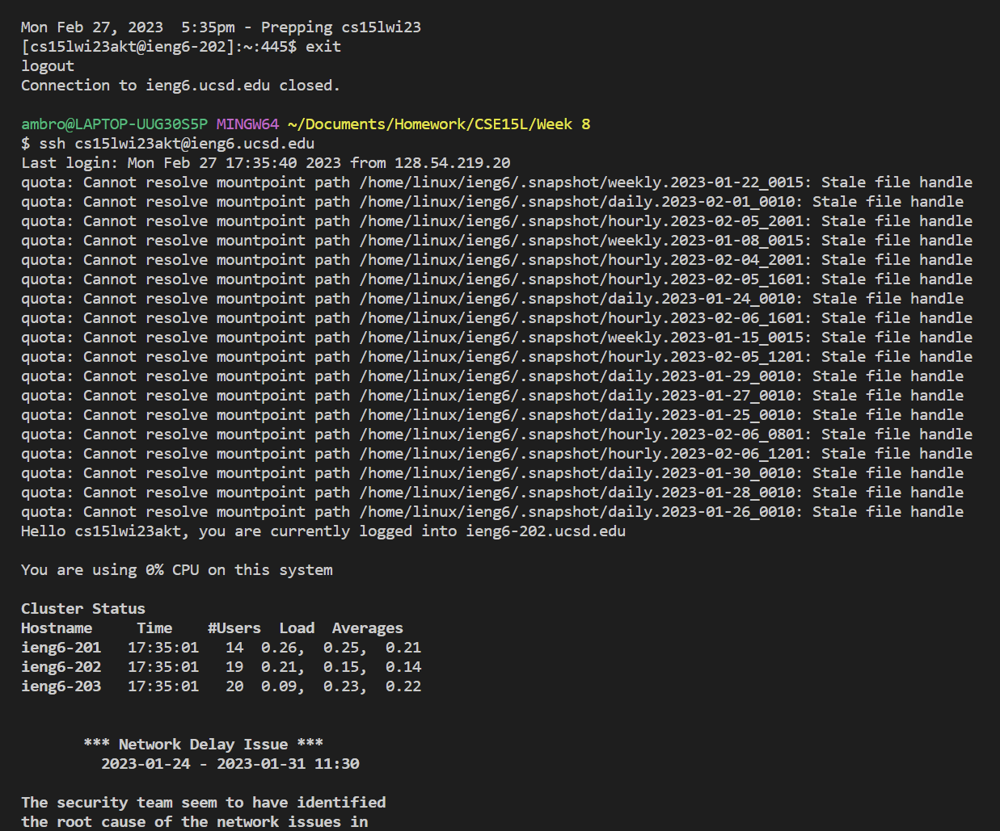

## 5. Clone your fork of the repository from your Github account

Keys pressed: `<ctrl-r>cl<enter>`

I've done the `git clone` command a week ago, yet it's still somewhere in the history!
I just had to do `<ctrl-r>` to find it with the pattern `cl`. 

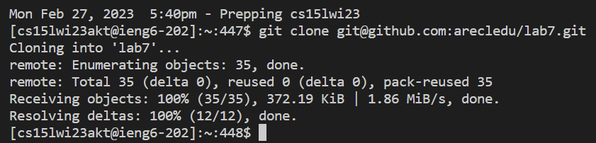

## 6. Run the tests, demonstrating that they fail

Keys pressed: `cd l<tab><enter><ctrl-r>ac<enter><ctrl-r>a <enter>`

First, we change directory into the newly cloned repo and then dig up a long
`javac` command from the depths of the history with `ctrl-r`. 
Now, our Java files are compiled with the .jar libraries in `./lib`.

Now, we dig up yet another long command, `java`, with the pattern `a ` (mind the space) to distinguish it from
the compiler (`javac`) command.

...and it fails!

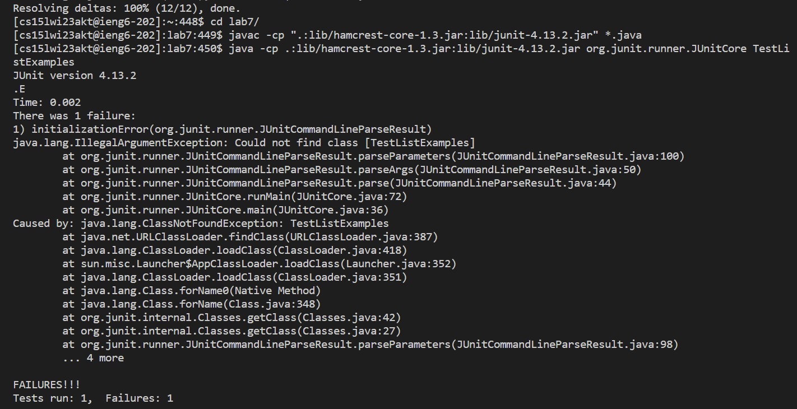

...Wait a minute. That's not right. `javac` successfully compiles, but Java couldn't find the class `TestListExamples`!

Let me check the repo...

Uh oh. They've changed the file name from `TestListExamples` to `ListExamplesTests` since last week!!

Last week:

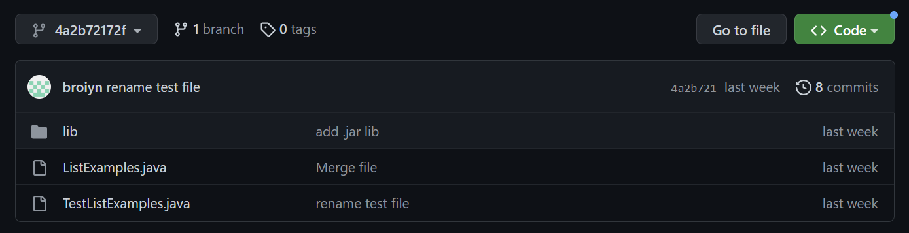

As of writing:

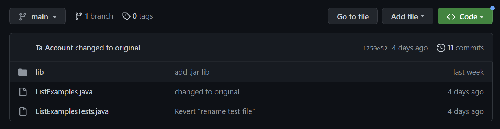

Let's pretend that it's always been `ListExamplesTests.java`. 

In our directory, the `ListExamplesTests.class` file already exists since our `javac` command compiles all Java files with `*.java`.

We'll execute the command `java -cp .:lib/hamcrest-core-1.3.jar:lib/junit-4.13.2.jar org.junit.runner.JUnitCore ListExamplesTests`, then try `<ctrl-r>a <enter>` again to pull it out of the history, pretending it's from last week. This works since `ctrl-r` pulls up the latest command, so it won't use the `java` command from last week.

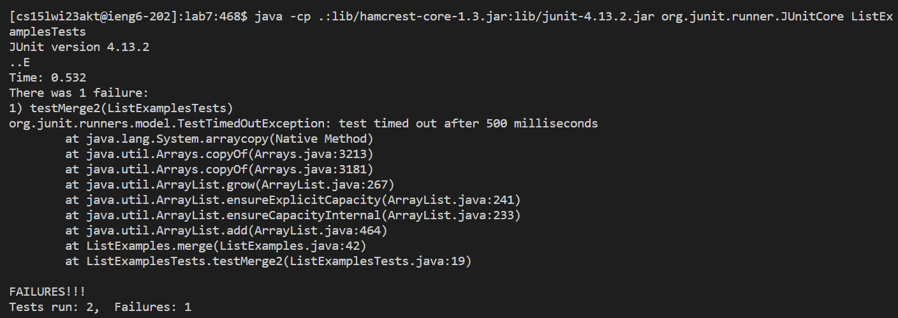

Now *that* is what it's supposed to look like.

## 7. Edit the code file to fix the failing test

Keys pressed: `<ctrl-r>na<enter>`

We pull up `ListExamples.java` on `nano`, and we've pulled it up in the past, so
we can just grab it from our history.

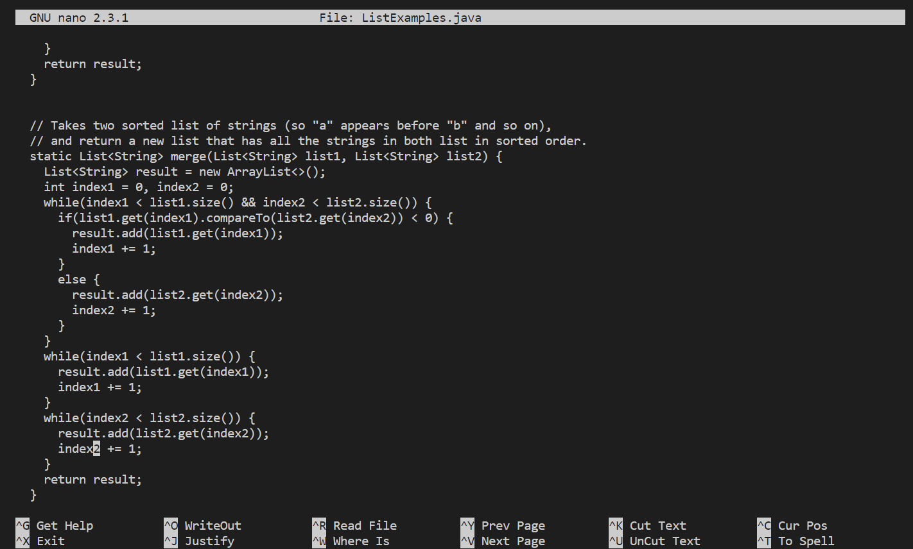

Keys pressed (in nano): `<down (held)><right (held)><backspace>2<ctrl-o><enter><ctrl-x>`

Here, we manually hold down down and then right to the line where the erroneous `index1 += 1;` is and change the 1 to a 2.
Then, we `WriteOut`, and, since `ListExamples.java` is already the default, press enter.

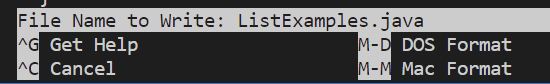

Then, we exit with `ctrl-x`.

## 8. Run the tests, demonstrating that they now succeed

Keys pressed: `<ctrl-r>ac<enter><ctrl-r>va <enter>`

We do mostly the same thing as last time for compiling, *except* that we put in `va ` instead of just `a ` as a pattern
because `nano ListExamples.java` *also* has the pattern `a `. We add the extra v to avoid ambiguity.

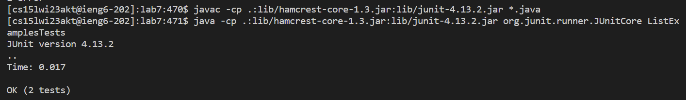

As we can see, the tests pass!

## 9. Commit and push the resulting change to your Github account

Keys pressed: `<ctrl-r>ad<enter><ctrl-r>mm<enter><ctrl-r>pu<enter>`

We execute all the commands from last week through searching our history with `ctrl-r`.

I already set up the GitHub SSH keys on `ieng6`, so it should still work.

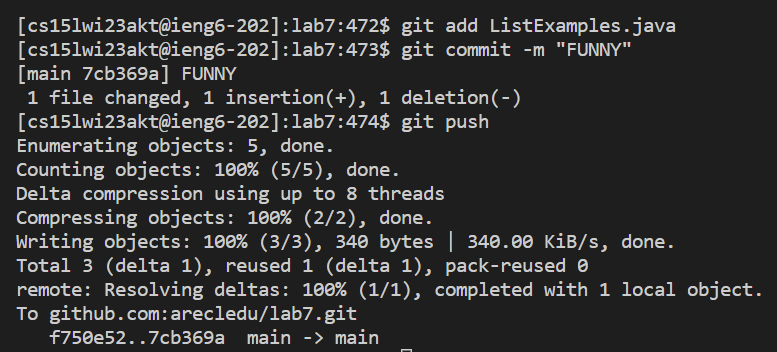

...And it's on GitHub!

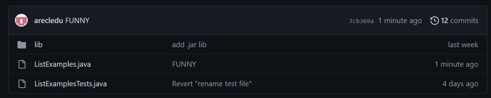
