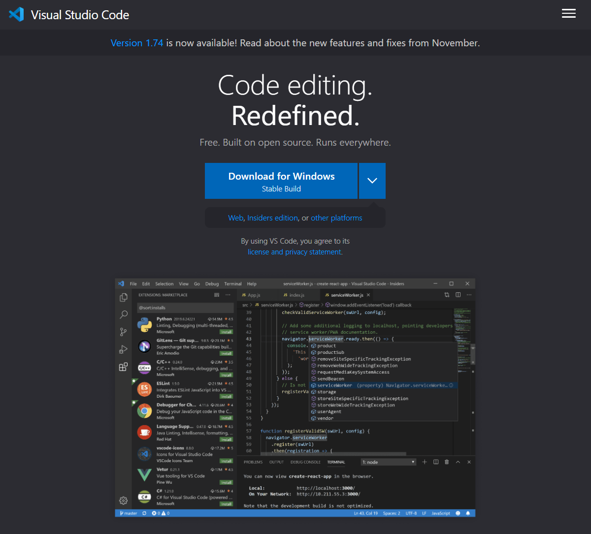

# Week 1 Lab Report
## How to Log Into `ieng6`

### Step 1. Install Visual Studio Code
You already have Visual Studio Code, don't you?
Download it [here](https://code.visualstudio.com/).

All of these lab computers already have Visual Studio Code pre-installed, so I don't have any screenshots of the installation process.
Instead, here's a screenshot of the website.

.

### Step 2. Connect Remotely

### Step 3. Try Out Some Commands

