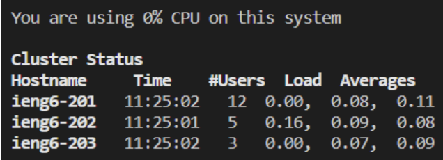
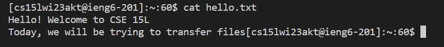

# Week 1 Lab Report
## How to Log Into `ieng6`

### Step 1. Install Visual Studio Code
The computer I used at the department already had Visual Studio Code pre-installed, so I don't have any screenshots of the installation process.

If you're reading this, you probably already have Visual Studio Code too.

If not, download it [here](https://code.visualstudio.com/)!

Here's a screenshot of the VS Code website. Just click that big blue button.

.

### Step 2. Connect Remotely

Now, we'll want to connect to `ieng6` with SSH.

However! If it's your first time setting this up and you don't know your course-specific account name, there's one thing you must do before anything else.

#### For First-Time Users: Find Your Account and Set Password

Go to [UCSD's Account Lookup](https://sdacs.ucsd.edu/~icc/index.php) page to find your account username.

.

There it is! Now, click on it and click on change your password to set it.

Put in your TritonLink password, and put in the password you want to use for your course account twice.

Now, pay special attention!

Don't change MyTritonLink password. Don't click Check Password. Instead, press Enter inside the Confirm Password text field.

.

Once you have that done, please wait at least an hour before continuing for your account password to update.

#### Actually Connect to `ieng6`

Now it's time to get SSH running.

If you're using Windows 10 or above, you already have an SSH client on your computer.

(It's kind of like Uno. It comes free with your Xbox 360, unless you have the oldest Xbox known to man.)

To test differences between dealing with commands in both server and client computers, you'll also need to have some way of typing in UNIX commands into your own computer (rather than through SSH), so [download GitHub Desktop](https://desktop.github.com/).

Its installation comes with `git`, which also has `git bash`, which is what we're going to use to use UNIX commands on your own computer.


#### Setup the Terminals

Open Visual Studio Code.

You don't even have to make a new file. Just go to the Menu Bar (this is what Microsoft calls it) on top and dropdown `Terminal`.

Then, click on `New Terminal`.


Bam! There's a fresh terminal at the bottom of your screen. It's running PowerShell. You can see it on the top-right of that pane.

Now type in the following line, but replace it with your account name:
```
ssh cs15lwi23abc@ieng6.ucsd.edu
```
You'll get a warning about the authenticity of the host.
Just type in `yes` and press Enter.

Now! The password!
Type in the password you entered when setting up your account.
You'll notice that there's nothing appearing when you type. That's for security. Whatever you're typing is still input.

Press enter when you're done... and you should see that you're in!



Now that you're connected with SSH, it's time to do the same for your own local computer. It's easier.

Just click on the dropdown on the top-right and click Git Bash.


If you don't see that, you can *alternatively* click PowerShell instead and type in `git bash`.

Bam! Now you can use UNIX commands on your own system *and* in a remote one.

You can swap between the terminals on the sidebar.

### Step 3. Try Out Some Commands

Let's see what these guys can do.
We'll be testing certain commands on both terminals.
I'll be reposting my findings from a shared Google doc here.

```
cd ~
pwd
```

**Client**


Looks like home is `/c/Users/areclusado`.

**Server**


Looks like home is `/home/linux/ieng6/cs15lwi23/cs15lwi23akt` instead.

`-cd`

**Client**


**Server**


`cd` without any arguments didn’t seem to do anything.

`ls -lat`

**Client**


Wow! That looks like all the files in the user root directory.

**Server**


Looks like these files only use extensions. Interesting!
Both of these appear to be in reverse alphabetical order.

`ls -a`

**Client**


**Server**


Does the same thing as ls -lat, but with less information and also horizontally.

Let’s try to list off Susan Shen's directory...
`ls /home/linux/ieng6/cs15lwi23/cs15lwi23akv`

**Server**


Uh oh! Can’t do that.
There’s no error that it doesn’t exist, just that there’s no permission to get into it.
Something that has to do with privileges?

**Client**


Nope. Doesn’t exist on this computer.

Let's try copying a file from a public folder onto our home folder.
`cp /home/linux/ieng6/cs15lwi23/public/hello.txt ~/`

**Server**


Hmmm… Did someone remove hello.txt? That seems to be the problem.

**Client**


As expected, it doesn’t work on Git Bash.

Hmm... That's weird. Let's try reading its data.
`cat /home/linux/ieng6/cs15lwi23/public/hello.txt`

**Server**


...It looks like it disappeared?
We can’t print or copy something that's gone.
You can’t really do anything to this public directory either.
I guess people forgot to add it?

**Client**


Hello.txt isn’t just gone. It probably never existed on this computer.

Well, let's try a few more commands.

**Server**


Oh! Looks like they've added `hello.txt` back.

**Client**


Here, I'm copying `hello.txt` to my computer, editing it, and uploading it back.

**Server**



Looks like it works!
